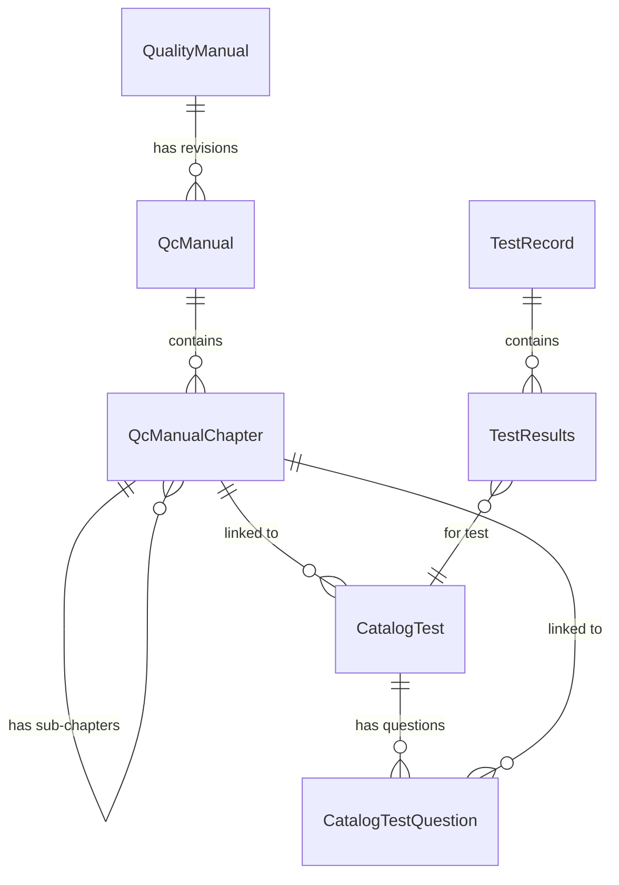

# Sistema de Control de Calidad (Backend)

## 1. Visión General

Este módulo gestiona el control de calidad mediante un enfoque **relacional estructurado**, implementando un sistema de manuales versionados con capítulos jerárquicos y pruebas vinculadas.

### Características Clave

- **Manuales Versionados**: Sistema de identidad (`QualityManual`) con revisiones auditadas (`QcManual`) que contienen capítulos estructurados.
- **Jerarquía de Capítulos**: Capítulos (`QcManualChapter`) con soporte para sub-capítulos y pruebas anidadas mediante relaciones padre-hijo.
- **Catálogo de Pruebas**: Pruebas (`CatalogTest`) vinculadas a capítulos específicos con preguntas (`CatalogTestQuestion`).
- **Ejecución y Aprobación**: Flujo de estados estricto para registros de prueba con validación de roles.

---

## 2. Modelo de Datos

### 2.1 Identidad del Manual: `QualityManual`

Representa la identidad única de un manual de calidad.

| Campo | Tipo | Descripción |
|-------|------|-------------|
| `id` | Integer | Clave primaria |
| `name` | String | Nombre único del manual (ej: "Manual de Línea 1") |
| `created_at` | DateTime | Fecha de creación |
| `created_by` | String | Usuario creador |

**Relación**: Un `QualityManual` puede tener múltiples **revisiones** (`QcManual`).

---

### 2.2 Revisión del Manual: `QcManual`

Representa una versión/revisión específica de un manual.

| Campo | Tipo | Descripción |
|-------|------|-------------|
| `id` | Integer | Clave primaria |
| `quality_manual_id` | Integer (FK) | Referencia a `QualityManual` |
| `createdAt` | DateTime | Fecha de creación de la revisión |
| `created_by` | String | Usuario que creó esta revisión |

**Relaciones**:
- Pertenece a un `QualityManual`
- Contiene múltiples `QcManualChapter` (cascading delete)

---

### 2.3 Capítulo del Manual: `QcManualChapter`

Representa un capítulo, sub-capítulo o sección de prueba dentro de una revisión.

| Campo | Tipo | Descripción |
|-------|------|-------------|
| `id` | UUID | Clave primaria |
| `manual_id` | Integer (FK) | Referencia a `QcManual` |
| `parent_chapter_id` | UUID (FK, nullable) | Referencia a capítulo padre |
| `title` | String | Título del capítulo |
| `content` | Text (nullable) | Contenido HTML del capítulo |
| `chapter_type` | String | Tipo: `'chapter'`, `'sub_chapter'`, `'test'` |
| `order` | Integer | Orden de visualización dentro del padre |
| `created_at` / `updated_at` | DateTime | Campos de auditoría |
| `created_by` / `updated_by` | String | Campos de auditoría |

**Relaciones**:
- Pertenece a un `QcManual`
- Puede tener un `parent_chapter` y múltiples `sub_chapters` (auto-referencia)
- Puede tener múltiples `CatalogTest` vinculados

---

### 2.4 Catálogo de Pruebas: `CatalogTest`

Define las pruebas disponibles para ejecución.

| Campo | Tipo | Descripción |
|-------|------|-------------|
| `id` | UUID | Clave primaria |
| `name` | String | Nombre de la prueba |
| `quality_manual_id` | Integer (FK, nullable) | Manual al que pertenece |
| `chapter_id` | UUID (FK, nullable) | Capítulo vinculado |
| `chapter` | String (nullable) | **Legacy**: Nombre del capítulo (compatibilidad) |
| `status` | Boolean | Activo/Inactivo |

**Relaciones**:
- Puede tener múltiples `CatalogTestQuestion` (cascading delete)
- Se vincula a `QualityManual` y `QcManualChapter`

---

### 2.5 Preguntas del Catálogo: `CatalogTestQuestion`

Preguntas individuales dentro de una prueba.

| Campo | Tipo | Descripción |
|-------|------|-------------|
| `id` | UUID | Clave primaria |
| `catalog_test_id` | UUID (FK) | Prueba a la que pertenece |
| `chapter_id` | UUID (FK, nullable) | Capítulo específico de la pregunta |
| `question` | String | Texto de la pregunta |
| `specification` | String (nullable) | Especificación técnica |
| `type` | Enum | `'open'` o `'close'` |

---

### 2.6 Registro de Ejecución: `TestRecord`

Registra la ejecución de pruebas por lote.

| Campo | Tipo | Descripción |
|-------|------|-------------|
| `id` | UUID | Clave primaria |
| `lote` | Integer (FK) | Número de lote (referencia a `order.lote`) |
| `code_id` | UUID (FK) | Código de producto |
| `status` | Enum | `'undone'`, `'pending'`, `'done'`, `'accepted'` |
| `performed_by` | String (nullable) | Usuario ejecutor |
| `performed_at` | DateTime (nullable) | Fecha de ejecución |
| `approved_by` | String (nullable) | Usuario aprobador |
| `approved_at` | DateTime (nullable) | Fecha de aprobación |
| `comment` | String (nullable) | Comentarios |

**Relación**: Contiene múltiples `TestResults` (cascading delete).

---

### 2.7 Resultados de Prueba: `TestResults`

Almacena las respuestas individuales por prueba.

| Campo | Tipo | Descripción |
|-------|------|-------------|
| `id` | UUID | Clave primaria |
| `test_record_id` | UUID (FK) | Registro de ejecución |
| `catalog_test_id` | UUID (FK) | Prueba del catálogo |
| `answer` | JSONB | Respuestas en formato JSON |

---

### 2.8 Enumeraciones

#### `TestStatus`
```python
undone   # Sin realizar
pending  # En proceso
done     # Completado
accepted # Aprobado
```

#### `QuestionType`
```python
open   # Pregunta abierta (texto libre)
close  # Pregunta cerrada (respuesta fija)
```

---

## 3. Endpoints API

### 3.1 Manuales (`/manual`)

| Método | Endpoint | Descripción | Roles |
|--------|----------|-------------|-------|
| `POST` | `/` | Crear nuevo manual con capítulos (Payload completo) | Admin, QC_Coordinator |
| `POST` | `/identity` | Crear identidad de manual (Nombre) | Autenticado |
| `PATCH` | `/identity` | Renombrar identidad de manual | Admin, QC_Coordinator |
| `GET` | `/names` | Listar nombres de manuales | Autenticado |
| `GET` | `/identities` | Listar identidades (id + nombre) | Autenticado |
| `GET` | `/chapters` | Obtener capítulos del último manual | Autenticado |
| `GET` | `/hierarchy` | Obtener jerarquía completa de capítulos | Autenticado |
| `GET` | `/section/{name}` | Obtener contenido de una sección específica | Autenticado |
| `GET` | `/{manual_id}/full-content` | Obtener contenido completo de un manual | Autenticado |
| `PATCH` | `/reorder` | Reordenar manuales | Admin, QC_Coordinator |
| `GET` | `/latest` | Obtener la última revisión | Autenticado |
| `DELETE` | `/{name}` | Eliminar manual y todas sus revisiones | Admin, QC_Coordinator |

#### Capítulos (Relativo a `/manual`)

| Método | Endpoint | Descripción | Roles |
|--------|----------|-------------|-------|
| `POST` | `/{manual_id}/chapters` | Crear capítulo en un manual | Admin, QC_Coordinator |
| `PATCH` | `/{manual_id}/chapters/{chapter_id}` | Actualizar capítulo | Admin, QC_Coordinator |
| `DELETE` | `/{manual_id}/chapters/{chapter_id}` | Eliminar capítulo y sub-capítulos | Admin, QC_Coordinator |
| `PATCH` | `/{manual_id}/chapters/reorder` | Reordenar capítulos | Admin, QC_Coordinator |
| `GET` | `/hierarchy` | Obtener jerarquía completa (usa `name` query param) | Autenticado |

---

### 3.2 Catálogo de Pruebas (`/catalog_tests`)

| Método | Endpoint | Descripción | Roles |
|--------|----------|-------------|-------|
| `POST` | `/` | Crear prueba con preguntas | Admin, QC_Coordinator, QC_Assistant |
| `GET` | `/` | Listar todas las pruebas | Admin, QC_Coordinator, QC_Assistant |
| `PATCH` | `/{test_id}` | Actualizar prueba | Admin, QC_Coordinator, QC_Assistant |
| `DELETE` | `/{test_id}` | Eliminar prueba | Admin, QC_Coordinator, QC_Assistant |

---

### 3.3 Ejecución de Pruebas (`/qctest`)

| Método | Endpoint | Descripción | Roles |
|--------|----------|-------------|-------|
| `GET` | `/session/{lote}/{code_id}` | Obtener sesión de prueba existente | Autenticado |
| `POST` | `/session` | Crear/actualizar sesión de prueba | Autenticado |
| `PATCH` | `/session/{id}/status` | Actualizar estado de sesión | Autenticado (accepted: solo QC_Coordinator) |
| `GET` | `/{lote}` | Obtener registro por lote (legacy) | Autenticado |

---

## 4. Guía de Integración Frontend

### 4.1 Editor de Manuales

**Flujo de Carga:**
1. `GET /manual/identities` → Obtener lista de manuales disponibles
2. `GET /manual/content/{manual_id}` → Cargar contenido completo para edición

**Flujo de Guardado:**
1. El frontend construye el payload con la estructura de capítulos:
   ```json
   {
     "name": "Manual de Línea 1",
     "content": [
       {
         "title": "Capítulo 1",
         "content": "<p>HTML content</p>",
         "chapter_type": "chapter",
         "sub_chapters": [
           {
             "title": "Sub-capítulo 1.1",
             "content": "<p>...</p>",
             "chapter_type": "sub_chapter"
           }
         ]
       }
     ]
   }
   ```
2. `POST /manual/` → Crear nueva revisión

**Jerarquía de Capítulos:**
- Los capítulos utilizan `chapter_type` para diferenciar niveles:
  - `'chapter'`: Capítulo principal (H1)
  - `'sub_chapter'`: Sub-capítulo (H2)
  - `'test'`: Sección de prueba (H3)

---

### 4.2 Catálogo de Pruebas

**Flujo de Creación:**
1. `GET /manual/hierarchy` → Obtener árbol de capítulos para selector
2. El usuario selecciona un capítulo del árbol
3. `POST /catalog_tests/` con payload:
   ```json
   {
     "name": "Prueba de pH",
     "quality_manual_id": 1,
     "chapter_id": "uuid-del-capitulo",
     "status": true,
     "questions": [
       {
         "question": "¿El pH está dentro del rango?",
         "specification": "6.5 - 7.5",
         "type": "close",
         "chapter_id": "uuid-opcional"
       }
     ]
   }
   ```

---

### 4.3 Ejecución de Pruebas (Operador)

**Ciclo de vida:** `undone` → `pending` → `done` → `accepted`

**Flujo:**
1. `GET /qctest/session/{lote}/{code_id}` → Buscar sesión existente (404 si no existe)
2. `POST /qctest/session` → Crear o actualizar sesión con resultados:
   ```json
   {
     "lote": 12345,
     "code_id": "uuid-codigo",
     "comment": "Observaciones",
     "results": [
       {
         "catalog_test_id": "uuid-prueba",
         "answer": {"pregunta_1": "valor", "pregunta_2": "valor"}
       }
     ]
   }
   ```
3. Al guardar, el estado cambia automáticamente a `pending`

---

### 4.4 Aprobación (Coordinador)

**Flujo:**
1. Visualizar sesiones con `status: 'pending'` o `'done'`
2. Solo usuarios con rol `QC_COORDINATOR` pueden aprobar
3. `PATCH /qctest/session/{id}/status`:
   ```json
   { "status": "accepted" }
   ```
4. El backend valida el rol y registra automáticamente `approved_by` y `approved_at`

---

### 4.5 Reordenamiento

**Manuales:**
- `PATCH /manual/reorder`
- Payload: `{"orders": [{"id": 1, "order": 1}, {"id": 2, "order": 2}]}`

**Capítulos:**
- `PATCH /manual/{manual_id}/chapters/reorder`
- Payload: `{"orders": [{"id": "uuid-cap-1", "order": 1}, {"id": "uuid-cap-2", "order": 2}]}` (Los IDs son UUIDs)

---

## 5. Estructura de Archivos

```
app/modules/quality/
├── api/
│   ├── routes_manual.py         # Endpoints de manuales y capítulos
│   ├── routes_catalog_test.py   # Endpoints de catálogo de pruebas
│   ├── routes_qctest.py         # Endpoints de ejecución
│   ├── routes_test_question.py  # Endpoints de preguntas (legacy)
│   ├── routes_test_record.py    # Endpoints de registros (legacy)
│   ├── routes_test_results.py   # Endpoints de resultados
│   └── routes_code_test.py      # Endpoints de códigos de prueba
├── models/
│   ├── quality_manual.py        # Modelo QualityManual
│   ├── qc_manual.py             # Modelo QcManual
│   ├── qc_manual_chapter.py     # Modelo QcManualChapter
│   ├── catalog_test.py          # Modelo CatalogTest
│   ├── catalog_test_question.py # Modelo CatalogTestQuestion
│   ├── test_record.py           # Modelo TestRecord
│   ├── test_results.py          # Modelo TestResults
│   ├── test_status.py           # Enum TestStatus
│   └── question_type.py         # Enum QuestionType
├── schemas/
│   ├── qc_manual.py             # Schemas de manual
│   ├── qc_manual_chapter.py     # Schemas de capítulos
│   ├── catalog_test.py          # Schemas de catálogo
│   ├── catalog_test_question.py # Schemas de preguntas
│   └── test_record.py           # Schemas de registros
└── services/
    ├── qc_manual_chapter_service.py  # Lógica de capítulos
    ├── find_chapters.py              # Extracción de capítulos
    └── split_sections.py             # División de secciones
```

---

## 6. Diagrama de Relaciones


